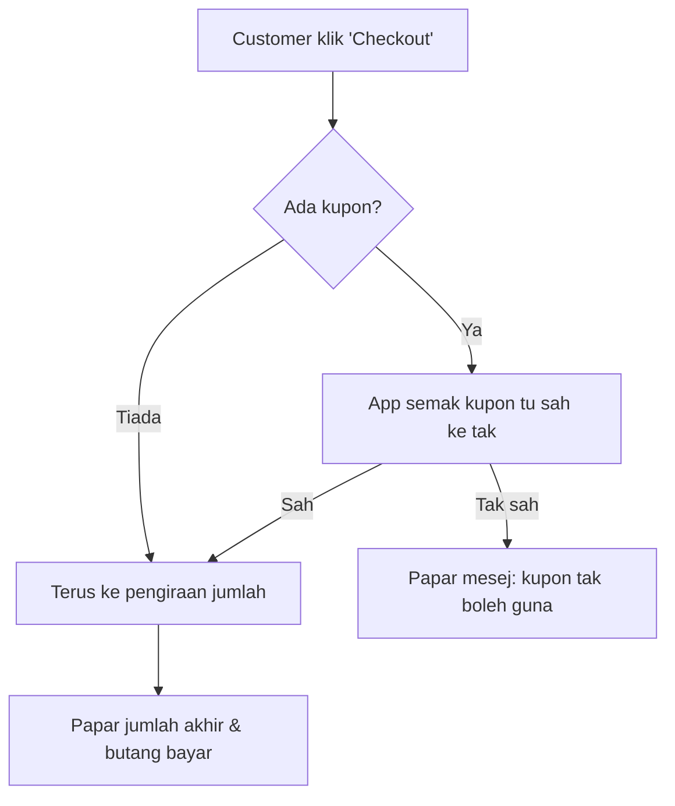

# Explain Human

The person asking is not a programmer. They cannot read a controller, a Livewire component, or a query and picture what happens. Your job is to actually trace the real code for the flow they're asking about, then retell it the way you'd explain it to a smart friend who has never coded — using things they already understand (queues at a counter, a filing cabinet, a security guard checking IDs) instead of technical vocabulary.

The two failure modes to avoid:
- **Explaining it anyway in disguise** — swapping "controller" for "handler" doesn't help; the explanation must work even if the reader has never heard the word "backend."
- **Explaining a flow you didn't actually verify** — guessing at what the code probably does defeats the point. Always read the real files first. If you explain a step that isn't in the code, you've just written a beautiful, wrong document.

## Step 1 — Pin down which flow

If the user named a flow clearly ("checkout", "guest checkout with coupon", "how admin approves an order"), go straight to Step 2. If it's vague ("explain how this app works"), ask them to name one concrete flow — this skill is for one flow at a time, done well, not the whole app at once. A good flow is something with a clear start and end a user would recognize: "customer adds to cart and pays," "admin logs in with 2FA," "someone applies a coupon code."

## Step 2 — Trace the real code

Do not rely on memory of what a typical Laravel app does — this codebase has its own routes, middleware, and conventions. Find the actual chain for this specific flow:

1. Find the entry point: check `routes/*.php` for the relevant route, or the Livewire component that handles the user's action.
2. Follow it through: controller/component method → any Form Request validation → model/Eloquent calls → jobs/events/listeners/mail fired → what the user ends up seeing.
3. Note anything that branches (e.g. "if the coupon is expired, this happens instead") — real flows aren't a straight line, and the beginner explanation should mention the important forks, not just the happy path.

For anything beyond a quick 2-3 file lookup, delegate to an `Explore` agent to trace the flow — it's faster and keeps your own context free for the writing. Ask it to report back the concrete call chain with file:line references, not a summary.

Keep a running list of file:line references as you go — you'll need them for the technical appendix in Step 5.

## Step 3 — Translate into plain language

Read [references/glossary.md](references/glossary.md) for a bank of ready-made analogies for common Laravel/Livewire/queue concepts (controller, middleware, job queue, event/listener, migration, and more). Use it as a starting point, not a script — pick or invent whatever analogy fits *this* flow best. A payment gateway callback might be "like a bank calling the shop to confirm your card cleared before they hand over the receipt"; forcing a generic analogy where a more specific one fits the story better makes it worse, not better.

Rules of thumb:
- If a term would send a non-coder to Google, replace it or explain it in the same breath.
- Prefer verbs over nouns: not "the FormRequest validates the input," but "the app double-checks what the customer typed before doing anything with it."
- Keep technical names (`OrderController`, `ApplyCouponAction`) out of the main narrative entirely — they belong only in the technical appendix (Step 5), for the rare reader who does code.
- Write in whatever language the user asked in (if they wrote in Bahasa Melayu, reply in Bahasa Melayu — casual, not formal/textbook Malay). Default to Bahasa Melayu if the request is ambiguous, since that's this project's normal usage.

## Step 4 — Build the diagram(s)

Every explanation gets a Mermaid `flowchart` (or `sequenceDiagram` if the story is really about *who talks to whom* — customer, browser, server, database — more than *what steps happen*). Label every node/step in the same plain language as the prose, not class or method names.



Use `<br/>` inside quoted node labels for line breaks, not `\n` — more reliable across GitHub's and VS Code's Mermaid renderers.

Keep diagrams under ~10-12 nodes. If the real flow is bigger than that, split it into two diagrams (e.g. "before payment" / "after payment") rather than cramming everything into one dense chart — a beginner loses the thread past a dozen boxes.

Where it adds clarity, add a second, different visual rather than a second flowchart — variety helps different readers:
- A **step table** (`Langkah | Apa yang jadi | Kenapa penting`) works well for linear flows.
- A **sequenceDiagram** works well when multiple "actors" (customer, admin, system, email) hand things off to each other.
- A **journey diagram** (`journey`) works well for a flow framed around one person's experience and how they'd feel at each step (useful for onboarding/UX-shaped flows).

Stick to Mermaid syntax that's safe on GitHub/VS Code previews: `flowchart`, `sequenceDiagram`, `journey`, `stateDiagram-v2`. Always mentally re-check bracket/quote matching before finalizing — a broken diagram is worse than no diagram, since it fails silently in most viewers.

## Step 5 — Write the file

Save to `docs/explain/<slug>.md`, where `<slug>` is a short kebab-case name for the flow (`guest-checkout-with-coupon.md`, `admin-order-approval.md`). Use this structure:

```markdown
# [Flow name in plain words]

## Dalam satu ayat
[1-2 sentence plain-language summary — what happens, start to end]

## Macam mana ni jalan
[The narrated walkthrough from Step 3 — a few short paragraphs or a numbered list,
whichever tells the story more naturally. Written for a total beginner.]

## Diagram
[Mermaid diagram(s) from Step 4]

## Langkah demi langkah
[Step table: Langkah | Apa yang jadi | Kenapa penting]

## Istilah (kalau nak tahu lebih)
[Optional: 2-4 term → plain-language footnotes, only for words that appeared
in the diagram/table and might still puzzle the reader]

---
### Rujukan teknikal (untuk developer)
[file:line references from Step 2 — the real chain, so a developer reader
can verify or dig deeper. Beginners can ignore this section entirely.]
```

If `docs/explain/` doesn't exist yet, create it. Also maintain `docs/explain/README.md` as a running index — one line per explanation written so far, linking to the file (`- [Guest checkout with coupon](guest-checkout-with-coupon.md)`). Create it on first use; append to it on subsequent runs rather than rewriting it.

## Step 6 — Report back

Tell the user the file path and give a one-paragraph plain-language summary right in the chat too — don't make them open the file just to know what you found. Mention that Mermaid diagrams render automatically in GitHub and VS Code (with the Mermaid preview), so no extra tooling is needed to view it.
