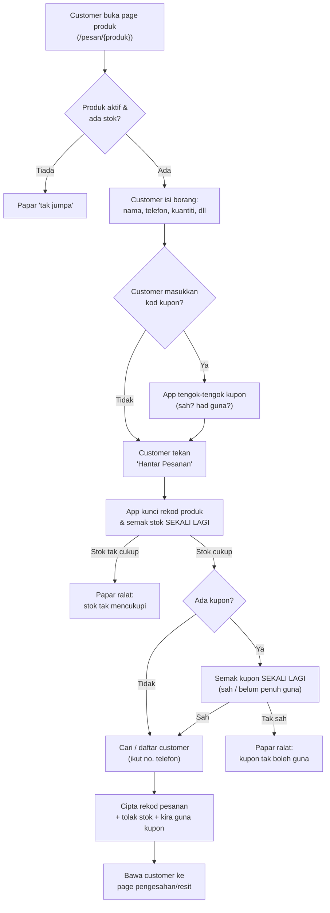

# Macam mana customer buat pesanan (checkout + kupon)

## Dalam satu ayat

Bila customer buka page produk, isi borang, dan hantar pesanan, app akan semak dulu stok & kupon tu betul-betul sah sebelum simpan pesanan — pastu terus tolak stok dan bawa customer ke page resit/pengesahan. Tiada email dihantar — semua jadi terus dalam satu proses.

## Macam mana ni jalan

Bila customer klik link produk (contoh `/pesan/nama-produk`), app mula-mula check produk tu masih aktif dan ada stok. Kalau tak ada atau dah *out of stock*, customer akan nampak page "tak jumpa" — macam kedai letak papan "produk habis, jangan datang".

Kalau produk okay, customer nampak borang: nama, no. telefon, alamat, kaedah bayaran, kuantiti, dan ruang untuk masukkan kod kupon (kalau ada). Bila customer taip kod kupon, app terus check kupon tu — masih dalam tempoh ke, dah sampai had guna ke belum, aktif ke tidak — dan terus tunjuk berapa diskaun yang customer akan dapat. Tapi ni baru "tengok-tengok" je, tak simpan apa-apa lagi.

Bila customer betul-betul tekan butang hantar, ini part penting: app **kunci** dulu rekod produk tu (macam staff kedai pegang barang tu sekejap supaya orang lain tak boleh amik serentak), pastu semak SEKALI LAGI — stok cukup ke tak, kupon still sah ke tak. Kenapa semak dua kali? Sebab antara masa customer buka borang tadi dengan masa dia hantar, mungkin ada customer lain dah beli habis stok, atau kupon tu dah sampai had guna. App tak nak simpan pesanan berdasarkan maklumat lama.

Lepas semua lepas, app cari customer sedia ada (guna no. telefon) atau daftar baru kalau belum ada, cipta rekod pesanan dengan nombor pesanan sendiri (contoh `ORD-20260714-0001`), tolak stok produk ikut kuantiti yang dibeli, dan (kalau guna kupon) tambah kiraan "berapa kali kupon ni dah digunakan". Selepas itu customer terus dibawa ke page pengesahan/resit yang tunjuk semua butiran pesanan — dan kalau bayaran secara pindahan bank, ada arahan macam mana nak buat pindahan.

Kalau pesanan tu dibatalkan kemudian hari (oleh admin), stok akan dikembalikan dan kiraan guna kupon pun dikurangkan semula — macam "kira semula" apabila barang dipulangkan.

## Diagram

## Langkah demi langkah

| Langkah | Apa yang jadi | Kenapa penting |
|---|---|---|
| 1. Buka page produk | App check produk masih aktif & ada stok | Elak customer isi borang untuk produk yang dah tak dijual |
| 2. Isi borang | Customer masukkan nama, telefon, alamat, kuantiti, kaedah bayaran | Maklumat ni akan digunakan untuk cipta pesanan & rekod customer |
| 3. (Pilihan) Masukkan kod kupon | App "tengok-tengok" sama ada kupon sah, dan tunjuk anggaran diskaun | Bagi customer nampak jumlah akhir sebelum hantar — tapi ni belum final |
| 4. Tekan "Hantar Pesanan" | App mula proses sebenar (kunci rekod produk dulu) | Kunci ni elak dua customer beli stok terakhir yang sama serentak |
| 5. Semak semula stok & kupon | App check SEKALI LAGI — bukan percaya check yang awal tadi | Antara borang dibuka dengan dihantar, keadaan mungkin dah berubah (stok habis / kupon tamat) |
| 6. Cari/daftar customer | App cari customer ikut no. telefon, atau daftar baru | Supaya rekod customer yang sama tak berulang setiap kali order |
| 7. Cipta pesanan, tolak stok, kira guna kupon | Rekod pesanan disimpan; stok produk berkurang; kiraan guna kupon bertambah | Ini "sah" pesanan tu — semua berlaku serentak, tak boleh separuh jalan |
| 8. Bawa ke page pengesahan | Customer nampak resit penuh — nombor pesanan, butiran, jumlah, arahan bayaran (jika bank transfer) | Bukti pesanan berjaya dibuat, siap dengan semua maklumat yang customer perlukan |

## Istilah (kalau nak tahu lebih)

- **"Kunci rekod"** — bila app proses pesanan, ia "pegang" rekod produk tu buat sekejap supaya tiada proses lain boleh ubah stok yang sama pada masa yang sama. Macam kaunter kedai letak barang tu ke tepi sekejap semasa proses bayaran.
- **"Transaction" (dalam DB)** — semua langkah simpan (cipta pesanan, tolak stok, kira guna kupon) berlaku sebagai satu paket "semua atau tiada langsung". Kalau satu langkah gagal di tengah jalan, semuanya dibatalkan — tak akan ada keadaan stok dah tolak tapi pesanan tak jadi.
- **Nombor pesanan (order_number)** — kod unik macam `ORD-20260714-0001` yang jadi "resit rujukan" untuk pesanan tu, digunakan untuk buka page pengesahan.

---
### Rujukan teknikal (untuk developer)

- Route: `routes/catalog.php:7` (`GET /pesan/{product:slug}` → `pages::catalog.order`), `routes/catalog.php:9` (`GET /pesanan/{order:order_number}` → `pages::catalog.confirmation`)
- Component: `resources/views/pages/catalog/⚡order.blade.php`
  - `mount()` — stock/active check: `⚡order.blade.php:32-37`, `app/Models/Product.php:77-80`
  - Coupon preview `applyCoupon()` — `⚡order.blade.php:54-75`; validity via `app/Models/Coupon.php:88-91` (`isExpired()` 75-81, `isExhausted()` 83-86); discount calc `discountAmount()`/`grandTotal()` — `⚡order.blade.php:44-52`, `Coupon.php:93-101`
  - `submit()` validation — `⚡order.blade.php:86-94`; calls `Order::placeOrder()` — `⚡order.blade.php:96-108`
- `Order::placeOrder()` — `app/Models/Order.php:101-159`, inside `DB::transaction()`:
  - Row lock + stock re-check — `Order.php:111-117`
  - Coupon row lock + re-validate + discount — `Order.php:124-132`
  - `Customer::findOrCreateFromOrderForm()` — `app/Models/Customer.php:35-45`
  - Order creation, `order_number` via `generateOrderNumber()` — `Order.php:89-96`, `137-152`
  - Stock decrement — `Order.php:154`; coupon `used_count` increment — `Order.php:155`
- Order cancellation restoring stock/coupon usage — `Order::transitionTo()`, `Order.php:161-178`
- Confirmation component: `resources/views/pages/catalog/⚡confirmation.blade.php` (`mount()` eager-loads `customer`/`product`, lines 12-15); receipt partial `resources/views/partials/order-receipt.blade.php`; bank transfer instructions `⚡confirmation.blade.php:26-29` via `config('sistem_jualan.bank_transfer_instructions')`
- Models: `Order` (`app/Models/Order.php:18-36`, relations 68-87), `Product`, `Customer`, `Coupon` (`type` enum in `app/Enums/CouponType.php`)
- No Jobs/Events/Mail/Notifications exist for this flow — it is fully synchronous (confirmed via codebase-wide search, no `app/Mail`, `app/Notifications`, `app/Jobs`, `app/Events`, `app/Listeners` directories).
