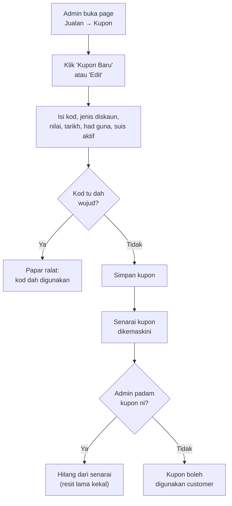
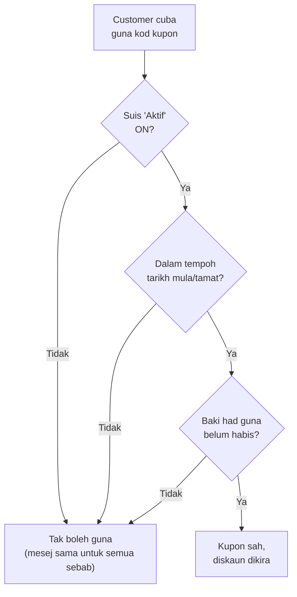

# Macam mana modul Kupon berfungsi

## Dalam satu ayat

Admin cipta dan urus kod kupon (kod, jenis diskaun, tempoh sah, had berapa kali boleh guna) di satu page khas; bila customer guna kod tu semasa buat pesanan, app check 3 benda je — suis aktif, dalam tempoh tarikh, dan belum sampai had guna — sebelum bagi diskaun, dan setiap kali kupon berjaya dipakai, "baki guna" dia berkurang secara automatik.

## Macam mana ni jalan

Bayangkan kupon macam **baucar diskaun kedai**. Admin yang cetak baucar baru: dia tetapkan kod baucar (contoh `RAYA10`), jenis diskaun — sama ada **peratus** (contoh 10%) atau **jumlah tetap** (contoh potong RM10 terus), berapa lama baucar tu sah, berapa kali maksimum ia boleh dipakai (atau tak had langsung), dan ada satu suis "Aktif/Tidak Aktif" untuk padam terus tanpa buang baucar tu dari sistem.

Semua kupon disenaraikan dalam satu page (Jualan → Kupon), dan setiap kupon ada status yang app kira sendiri — bukan admin set manual. Kalau suis tu OFF, statusnya "Tidak Aktif". Kalau dah lepas tarikh tamat (atau belum sampai tarikh mula), statusnya "Tamat Tempoh". Kalau dah sampai had guna maksimum, statusnya "Habis Digunakan". Kalau semua okay, baru dia "Aktif" dan boleh dipakai customer.

Bila admin **padam** kupon dari senarai, ia betul-betul hilang dari senarai kupon. Tapi menariknya — kalau kupon tu dah pernah dipakai dalam pesanan lama, resit pesanan lama tu **tetap** tunjuk kod kupon yang dipakai (macam resit lama tak berubah walaupun baucar dah tak wujud lagi di kaunter) — sebab app simpan kod tu sebagai teks terus dalam rekod pesanan, bukan hanya "rujuk" balik ke kupon asal.

Bila customer pula yang cuba guna kod kupon semasa buat pesanan (dalam page pesanan produk), app check kod tu terus — wujud ke tak, aktif ke tak, dalam tempoh ke tak, dan baki guna masih ada ke tak. Kalau mana-mana gagal, customer akan nampak **satu je** mesej ralat generik: *"Kod kupon tidak sah atau telah tamat tempoh"* — app tak bagitahu sebab spesifik (sama ada expired, tak aktif, atau dah habis kuota — semua bunyi macam sama je kat customer). Kalau lulus semua check, app terus kira & tunjuk berapa diskaun yang customer akan dapat sebelum dia hantar pesanan.

Satu perkara penting: check ni **dibuat dua kali** — sekali masa customer taip & klik "Guna" (untuk tunjuk-tunjuk je), dan sekali lagi masa customer betul-betul hantar pesanan (yang ni yang sah, "dikunci" supaya tak clash dengan customer lain guna kupon yang sama serentak). Sebab tu walaupun kupon nampak sah masa customer isi borang, ada kemungkinan kecil ia jadi tak sah masa dia hantar (contohnya orang lain dah habiskan baki guna kupon tu dulu) — flow penuh macam mana app handle checkout dan kupon ni dah didokumenkan dalam [Macam mana customer buat pesanan (checkout + kupon)](guest-checkout-with-coupon.md).

Modul kupon ni **tiada** had "minimum beli RM sekian" dan **tiada** had "satu kupon sekali guna setiap customer" — had guna (`max_uses`) tu adalah had global merentasi semua customer, bukan per-customer. Dan kalau pesanan yang guna kupon tu **dibatalkan** kemudian, baki guna kupon tu dikembalikan semula secara automatik — macam baucar yang dipulangkan balik ke dalam stok baucar.

## Diagram

### 1. Admin urus kupon

### 2. Bila kupon dianggap sah untuk dipakai

## Langkah demi langkah

| Langkah | Apa yang jadi | Kenapa penting |
|---|---|---|
| 1. Admin cipta kupon baru | Tetapkan kod unik, jenis diskaun (peratus/jumlah tetap), nilai, tempoh sah, had guna, suis aktif | Kod mesti unik supaya sistem tahu kupon mana yang dimaksudkan bila customer taip |
| 2. Status kupon dikira automatik | App bandingkan suis, tarikh, dan had guna untuk tentukan "Aktif" / "Tidak Aktif" / "Tamat Tempoh" / "Habis Digunakan" | Admin tak perlu tukar status manual — ia ikut keadaan sebenar |
| 3. Customer taip & "Guna" kod kupon | App semak kod tu wujud & sah, terus tunjuk anggaran diskaun | Bagi customer nampak jimat berapa sebelum dia teruskan bayar |
| 4. Customer hantar pesanan | App semak SEKALI LAGI (versi rasmi, dikunci) sebelum simpan pesanan | Elak dua customer "curi" baki guna yang sama pada saat yang sama |
| 5. Pesanan berjaya disimpan | Diskaun direkod dalam pesanan; baki guna kupon berkurang satu | Ini yang jadikan had guna kupon "berkurang" secara automatik |
| 6. (Jika berlaku) Pesanan dibatalkan | Baki guna kupon dikembalikan semula | Supaya kupon tak "hilang" kuota sebab pesanan yang tak jadi |
| 7. Admin padam kupon | Kupon hilang dari senarai/tak boleh dipakai lagi, tapi resit pesanan lama kekal tunjuk kod tu | Sejarah pesanan lama tak patut berubah walaupun kupon dah dipadam |

## Istilah (kalau nak tahu lebih)

- **Jenis diskaun "Peratusan" vs "Jumlah Tetap"** — Peratusan potong ikut % dari jumlah beli (contoh 10% dari RM100 = RM10 diskaun). Jumlah Tetap potong angka tetap tak kira berapa jumlah beli (contoh terus RM10, tapi tak akan lebih dari jumlah beli tu sendiri).
- **"Had guna" (max_uses) & "baki guna" (used_count)** — had guna ialah berapa kali maksimum kupon tu boleh dipakai (kosongkan kalau tak nak had). Baki guna ialah kiraan berapa kali ia dah dipakai setakat ini — bila sampai had, kupon automatik jadi "Habis Digunakan".
- **Kunci rekod (row lock)** — masa customer hantar pesanan, app "pegang" rekod kupon tu sekejap supaya tiada pesanan lain boleh guna baki guna yang sama serentak — macam kaunter yang proses satu pelanggan pada satu masa untuk baucar terhad.

---
### Rujukan teknikal (untuk developer)

- Route admin: `routes/sales.php:11` (`GET sales/coupons` → `pages::sales.coupons.index`)
- Model: `app/Models/Coupon.php`
  - Fillable `code, type, value, starts_at, expires_at, max_uses, used_count, is_active` — line 27
  - `booted()` normalizes code (uppercase/trim) on save — lines 33-38
  - `orders(): HasMany` — lines 61-64
  - `isExpired()` — lines 75-81; `isExhausted()` — lines 83-86; `isValidFor()` (gate = active && !expired && !exhausted) — lines 88-91
  - `calculateDiscount(float $subtotal)` — lines 93-101 (percentage clamped 0-100%, result always clamped to `[0, subtotal]`)
  - `findByCode()` — lines 103-106
  - Enum: `app/Enums/CouponType.php` (`Percentage`, `Fixed`)
- Admin list: `resources/views/pages/sales/coupons/⚡index.blade.php`
  - `deleteCoupon()` — lines 26-31 (`Coupon::findOrFail()->delete()`, no usage guard)
  - Status badge logic (mirrors `isValidFor()`) — lines 84-94
- Admin create/edit modal: `resources/views/pages/sales/coupons/⚡form-modal.blade.php`
  - `openModal()` — lines 29-51
  - `save()` validation (unique code, conditional max value by type, `expires_at after_or_equal starts_at`) — lines 53-83
- Customer-facing apply flow (full trace in [guest-checkout-with-coupon.md](guest-checkout-with-coupon.md)):
  - `applyCoupon()` (preview) — `resources/views/pages/catalog/⚡order.blade.php:54-75`
  - Authoritative re-check inside transaction, `used_count` increment — `app/Models/Order.php:101-159` (coupon block 123-133, increment line 155)
  - Cancellation reverses usage — `app/Models/Order.php:161-178` (decrement on cancel from Pending/Confirmed)
- Database: `database/migrations/2026_07_13_075615_create_coupons_table.php` (coupons table: `code` unique, `type`, `value`, `starts_at`, `expires_at`, `max_uses`, `used_count`, `is_active`); `database/migrations/2026_07_13_075616_add_coupon_columns_to_orders_table.php` (`orders.coupon_id` FK `nullOnDelete()`, `orders.coupon_code` snapshot text, `subtotal`, `discount_amount`)
- No `min_purchase` column and no per-customer usage limit exist anywhere in schema or code. No Events/Listeners/Jobs related to coupons.
