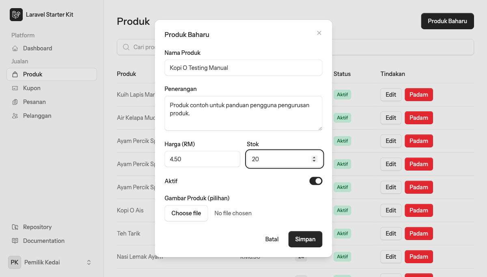
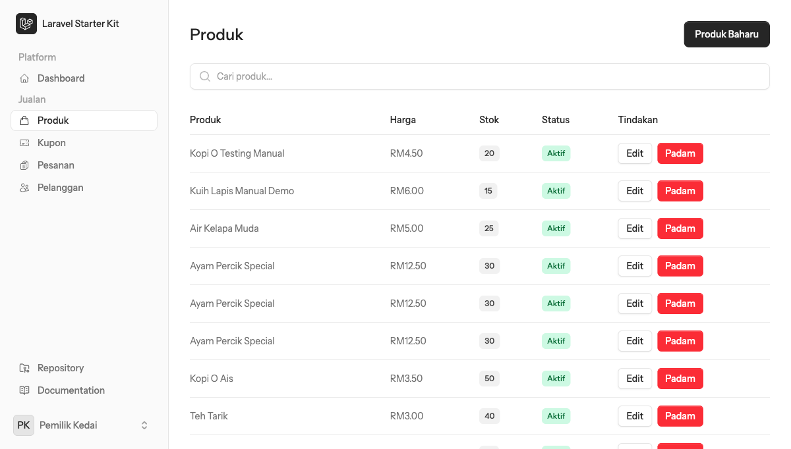
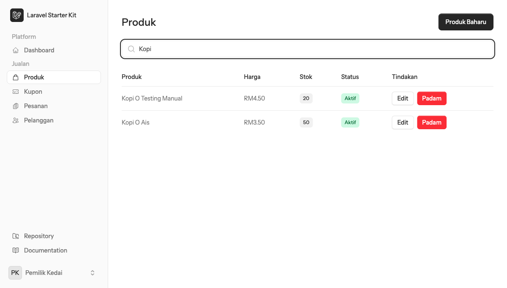
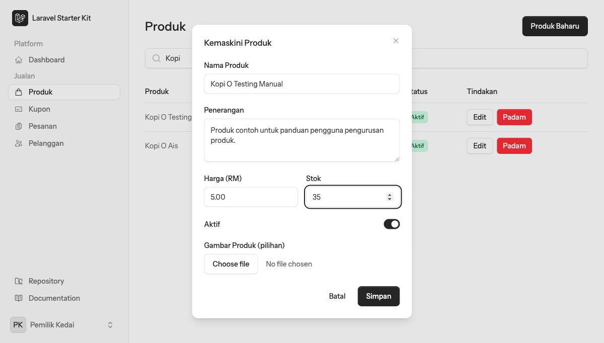
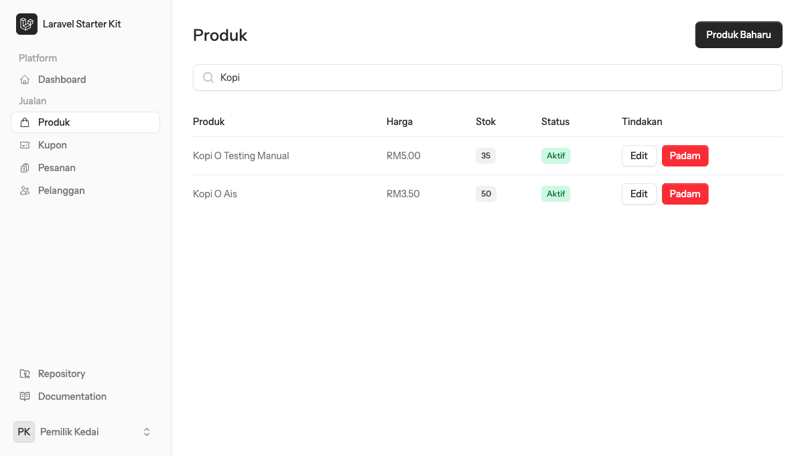
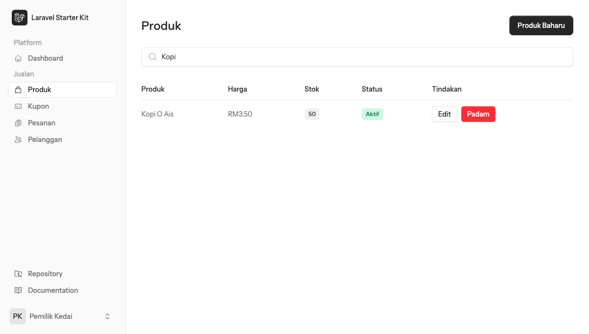

# Macam mana nak urus produk (tambah, cari, edit, padam)

## Sebelum mula

Panduan ini untuk **admin/pemilik kedai** yang sudah log masuk ke dashboard. Anda perlu berada di menu **Jualan > Produk**. Semua tindakan — tambah, cari, edit, dan padam produk — berlaku dalam satu halaman yang sama.

Contoh dalam panduan ini guna produk demo **"Kopi O Testing Manual"** yang dicipta, dikemaskini, dan dipadam semula semasa penulisan panduan ini — jadi produk ini takkan kekal dalam senarai selepas panduan siap dibuat. Kalau anda ada produk sedia ada, ia takkan terjejas.

## Langkah demi langkah

### 1. Pergi ke senarai produk

Klik **Produk** di bawah menu **Jualan** pada sidebar kiri. Anda akan nampak senarai semua produk yang sedia ada, lengkap dengan harga, stok dan status setiap satu.

### 2. Tambah produk baharu

Klik butang **Produk Baharu** di penjuru kanan atas. Satu borang akan terbuka dalam bentuk pop-up (dialog). Isi setiap medan:

- **Nama Produk** — nama produk yang akan dipaparkan
- **Penerangan** — huraian ringkas tentang produk
- **Harga (RM)** — harga jualan dalam Ringgit Malaysia
- **Stok** — kuantiti stok yang ada sekarang
- **Aktif** — suis ini hidup (on) secara default, bermakna produk akan terus dipaparkan untuk dijual
- **Gambar Produk (pilihan)** — boleh muat naik gambar produk, tapi ini pilihan sahaja

Selepas diisi, klik **Simpan**.

Borang akan tertutup secara automatik dan produk baharu terus muncul di **bahagian atas senarai produk**.

### 3. Cari produk

Kalau senarai produk dah panjang, taip nama produk dalam kotak **Cari produk...** di atas jadual. Senarai akan ditapis secara automatik mengikut nama yang ditaip, tanpa perlu tekan sebarang butang.

### 4. Edit produk sedia ada

Pada baris produk yang nak dikemaskini, klik butang **Edit**. Borang yang sama akan terbuka, tapi kali ini sudah terisi dengan maklumat produk itu. Ubah medan mana-mana yang perlu (contohnya harga atau stok), kemudian klik **Simpan**.

Senarai akan terus dikemaskini dengan maklumat baharu, dan mesej "Produk berjaya disimpan." akan muncul sekejap di penjuru skrin.

### 5. Padam produk

Pada baris produk yang nak dipadam, klik butang **Padam**. Satu kotak dialog pengesahan (dari pelayar sendiri, bukan bahagian dalam borang) akan keluar dengan mesej **"Padam produk ini?"** — klik **OK** untuk teruskan, atau **Cancel** untuk batal.

> Nota: dialog pengesahan ini ialah dialog asal pelayar (browser popup), jadi ia tidak boleh ditangkap dalam tangkapan skrin. Bentuknya akan berbeza sikit ikut pelayar yang digunakan (Chrome, Safari, dll), tapi mesejnya tetap sama.

Selepas disahkan, produk akan terus hilang dari senarai dan mesej "Produk telah dipadam." akan muncul.

## Selesai

Produk yang ditambah akan terus kelihatan (dan boleh dijual) sehingga dipadam atau dinyahaktifkan. Tindakan edit dan padam berlaku serta-merta — tiada langkah "simpan draf" berasingan.

## Masalah lazim

- **Padam produk perlu pengesahan dua kali** — sekali klik butang **Padam**, sekali lagi klik **OK** pada dialog pengesahan pelayar. Ini untuk elak produk terpadam secara tidak sengaja.
- Panduan ini tidak menguji senario ralat (contohnya borang dihantar dengan medan kosong) — kalau anda jumpa sebarang mesej ralat semasa guna borang ini, ambil tangkapan skrin dan kongsi untuk kemas kini panduan.
